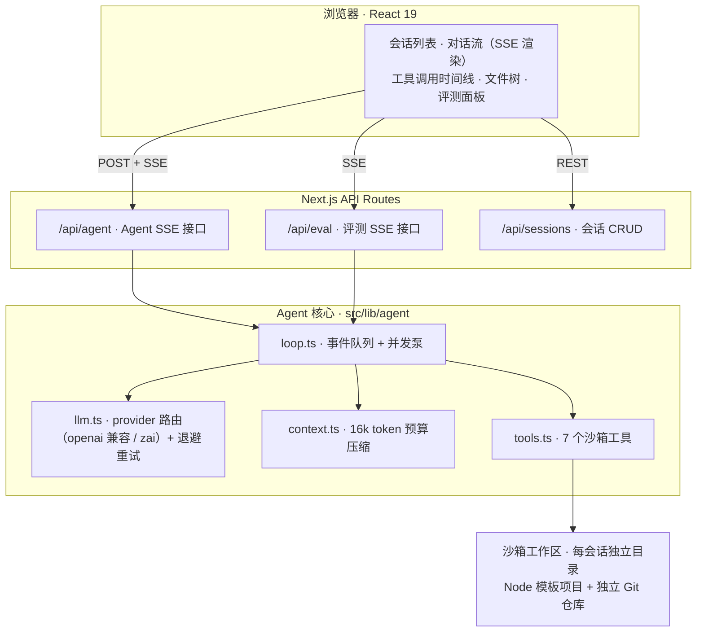
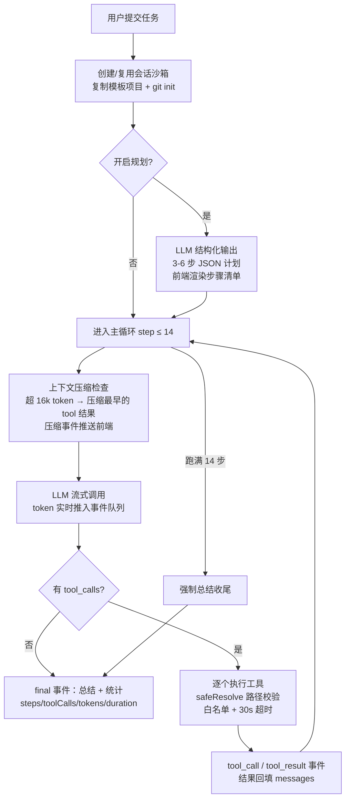
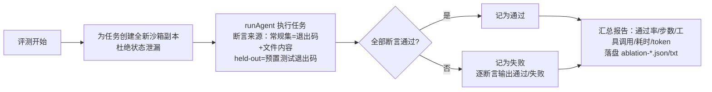

# DevMate · Mini PRD

| 项 | 内容 |
|---|---|
| 产品名 | DevMate — Browser-based Coding Agent |
| 版本 | v1.0（已实现并实测）· 本 PRD 为 v1.x 迭代规划基线 |
| 仓库 | https://github.com/SeupLio/devmate-coding-agent |
| 形态 | Web 全栈应用（Next.js 16 + React 19 + TypeScript + SQLite/Prisma），LLM 通过 OpenAI 兼容接口接入 |
| 一句话定位 | **在浏览器里给 Agent 一个编码任务，它在沙箱里自己读代码、改代码、跑测试、提交 Git，全过程流式可视化，且每一步效果都可被评测。** |

---

## 1. 背景

### 1.1 问题

Coding Agent（Claude Code / Codex / Cursor 等）已经成为 AI 编程的主流形态，但对绝大多数使用者和开发者来说它是一个黑盒：

1. **过程不可见**：Agent 到底读了哪个文件、为什么这样改、测试跑没跑，用户只能看到最终 diff。信任建立不起来，出错也无法定位。
2. **效果不可测**：「Agent 说它做完了」不等于做完了。业内普遍缺少针对自有 Agent 链路的可复现评测——通过率数字往往是自说自话（断言跟着实现写、任务集参与过调试）。
3. **能力边界不清**：规划、工具调用、自我验证、上下文压缩，每个组件到底贡献多少？没有对照实验，就无法回答「该往哪里投入」。

### 1.2 机会与切入点

DevMate 的切入点不是「再造一个更强的 Coding Agent」，而是把 Coding Agent 的**核心工程链路完整拆开、做小、做透明**：

- Agent 循环、7 个沙箱工具、上下文压缩、SSE 流式渲染、四层评测体系全部手写（约 2000 行核心代码，不用 LangChain 等框架），每个组件都可以被单独关掉做对照；
- 评测体系对齐 SWE-bench 方法论（held-out 任务集 + FAIL_TO_PASS 断言 + 变异测试自检），让「通过率」这个数字本身可信；
- 全过程在浏览器里流式可视化：规划清单、思考 token、工具调用卡片、文件树、评测面板同屏。

### 1.3 现状（v1.0 已交付）

- 端到端链路实测跑通：规划 → 流式输出 → 工具调用 → 测试验证 → Git 提交；
- 四层评测全部通过：L1 单元测试 34/34；L2 常规集 4/4 + held-out 集 4/4；L4 变异体检出率 7/7；
- L3 对照实验得出关键结论：**强模型 + 简单任务下 Agent 范式无增益（裸模型也 100%，成本反而贵 5.4 倍）；弱模型下自我验证带来 +25pp 通过率（50% → 75%）**——Agent 的价值出现在模型不确定的时候。

---

## 2. 目标用户与使用场景

| 用户 | Job-to-be-done | 现状痛点 | 用 DevMate 之后 |
|---|---|---|---|
| **AI 应用开发者**（主要） | 想搞懂 Coding Agent 的工程实现，并给自己的 Agent 链路建评测 | 读框架源码成本高；LangChain 把关键细节（工具设计、上下文预算、评测）藏起来了 | 2000 行可读实现 + 四层评测方法论可直接复刻；对照实验开关（plan / toolFilter / useCompression）现成 |
| **学生 / 求职者** | 需要能跑、能讲、能被验证的作品 | Demo 项目往往「看起来能跑」，说不清效果怎么衡量 | 内置评测面板一键跑分，报告落盘可复现；实测数据与局限都写在文档里 |
| **工程团队负责人** | 评估「引入 Coding Agent 到底值不值」 | 厂商宣传的通过率无法迁移到自己的任务上 | 换掉 `assets/template-project/` 即可在自有项目上评测，得到自己场景的通过率与成本数据 |

### 核心用户故事

- **US-1**（透明执行）：作为开发者，我想看到 Agent 每一步的规划、思考、工具调用参数与结果，以便判断它是否值得信任、错在哪里。
  *验收：对话流中 plan / token / tool_call / tool_result / context / final 事件全部实时渲染，工具卡片可展开看参数与结果。*
- **US-2**（安全沙箱）：作为平台提供方，我要保证 Agent 的文件、命令、Git 操作绝不越出会话沙箱。
  *验收：路径规范化拒绝 `..`/绝对路径/符号链接逃逸；命令白名单（node/ls/cat/git 等 10 个）；子进程 30s 超时强杀；每会话独立目录 + 独立 Git 仓库。对应单元测试全绿。*
- **US-3**（可信评测）：作为评估者，我要一个不能靠「迁就断言」刷分的评测。
  *验收：held-out 集断言 100% 来自预置测试退出码（FAIL_TO_PASS）；防作弊断言禁止删减原有测试；变异体检出率 100%。*
- **US-4**（能力归因）：作为架构决策者，我想知道每个组件值不值它的成本。
  *验收：`run-ablation.ts` 支持 6 组配置（含裸模型），报告通过率/步数/工具调用/耗时/token 五项指标并落盘。*

### 明确不做（边界）

| 不做 | 理由 |
|---|---|
| 生产级代码补全 / IDE 插件 | 与 Cursor / Copilot 正面竞争没有胜算；本产品价值在链路透明与评测 |
| 多语言沙箱（Python/Go/…） | v1 聚焦 Node 项目（`node --test` 零依赖），多语言属于 V2+ |
| 多 Agent 协作 | 单 Agent 循环还没评测清楚之前，多 Agent 只会引入更多不可归因的变量 |
| 云端托管沙箱 | 本地目录沙箱已满足评测需求；容器化隔离是部署形态问题，不影响产品主张 |

---

## 3. 核心流程

### 3.1 系统架构

### 3.2 单任务执行主流程

> 关键实现细节：LLM 的流式回调无法在 async generator 中直接 `yield`，因此采用「**事件队列 + 并发泵**」——生产者协程实时 push 事件，外层 generator 实时消费，保证 token 流与工具事件在同一条 SSE 流中交织输出。

### 3.3 评测流程（L2 任务评测）

防作弊断言贯穿始终：模板中的测试名一个不能少、`assert.` 调用数不能低于模板——允许新增用例，禁止删减原有用例。

---

## 4. 评测指标定义

四层评测体系。原则：**「Agent 说它做完了」不算数，评测器只看最终事实；评测器本身也要被评测。**

| 层 | 手段 | 回答什么问题 | 需要 LLM |
|---|---|---|---|
| L1 | 单元测试（34 条） | 代码有没有坏？沙箱安全 / 工具 / 压缩逻辑对不对？ | 否 |
| L2 | 任务评测集（4 常规 + 4 held-out） | 端到端链路能否跑通？能否泛化到新项目？ | 是 |
| L3 | 对照实验（5 组 + 裸模型） | 每个能力维度各自贡献多少？ | 是 |
| L4 | 评测灵敏度（7 变异体） | 评测本身是不是太松？ | 否 |

### 4.1 核心指标定义

| 指标 | 定义 | 测量方式 | v1.0 基线 |
|---|---|---|---|
| **任务通过率** | 全部断言通过的任务数 / 任务总数。断言 = 预置测试退出码（held-out 100%）+ 文件内容检查 + 防作弊检查 | `run-eval.ts`，每任务全新沙箱 | 常规 4/4，held-out 4/4（强模型）；75% / 50%（弱模型 full / no-verify） |
| **防作弊合规率** | 通过任务中「原有测试未被删减」的比例。测试名全集保留 + `assert.` 计数 ≥ 模板 | `originalTestsIntact()` 断言 | 100%（该盲区由 L4 发现并修复） |
| **变异检出率** | 参考解被故意破坏成 7 个变异体（作弊类 2 + 逻辑退化类 5）后，至少一条断言失败的比例。**检出 = 评测敏感；漏检 = 评测有洞，必须修断言而不是改结论** | `check-sensitivity.ts`，无需 LLM，秒级 | 7/7 = 100%；另正确剔除 1 个语义等价变异体 |
| **平均步数** | 主循环迭代次数（上限 14） | AgentStats.steps | 强模型 full：6.6~7.8 |
| **平均工具调用数** | 单任务 executeTool 次数 | AgentStats.toolCalls | 强模型 full：7.3~8.5 |
| **平均 token 消耗** | 全链路累计估算 token（含规划与压缩前上下文） | AgentStats.tokensUsed | full 11322 vs 裸模型 2086（**5.4 倍**，成本必须与效果同报） |
| **平均耗时** | 任务提交到 final 事件的墙钟时间 | AgentStats.durationMs | 强模型 full：44.6~50.4s |
| **稳定性（方差）** | 同配置重复 N 轮的通过率分布 | `--repeat N` | 3 轮 × 4 任务 = 12/12，未观察到方差 |

### 4.2 对照实验分组（L3）

固定任务集与模型，只改变一个能力维度：

| 组 | 配置 | 验证什么 |
|---|---|---|
| A · 完整配置 | 7 工具 + 规划 + 压缩 | 基线 |
| B · 无任务规划 | `plan: false` | 「先规划」的增量 |
| C · 无自我验证 | 移除 `run_tests` | 「改完自己跑测试」的增量 |
| D · 无代码检索 | 移除 `search_code` | 「按关键词定位代码」的增量 |
| E · 无上下文压缩 | `useCompression: false` | 压缩对长链路的影响 |
| F · 裸模型 | 无工具、单次输出全部文件 | Agent 范式相对 single-shot 的增量 |

### 4.3 指标的诚实边界（写进 PRD，防止数字被误读）

1. **通过率 100% 的边际信息量很低**：强模型下裸模型也能 4/4，只证明「链路可用」，不证明「Agent 设计优越」。当前任务集（单文件、单 bug）区分度不足，这是最大短板。
2. **不是 SWE-bench**：真 SWE-bench 用真实 GitHub issue + 真实仓库 + Docker；本项目是方法论复刻，分数不可类比。
3. **样本量小**（4+4 任务），无统计显著性，以 3 轮重复观察方差作补充。
4. **断言不含代码质量**：不检查复杂度、可读性、commit message 合理性。

---

## 5. 迭代规划

### v1.1 —— 评测区分度（最高优先级，直接由 L3 结论驱动）

| 事项 | 内容 | 验收 |
|---|---|---|
| 更难的任务集 | 多文件、长链路、必须依赖环境反馈才能完成的任务（跨文件重构、依赖失败测试驱动的实现、需要 grep 定位的隐性耦合 bug） | 强模型 full 与裸模型 F 组通过率差 ≥ 30pp（当前为 0） |
| 失败模式分类 | 评测报告增加「失败原因归类」（规划错误 / 工具误用 / 验证缺失 / 上下文丢失） | 每条失败任务带归类标签，报告聚合展示 |
| 扩大样本 | 任务集扩至 ≥ 12 常规 + ≥ 8 held-out | 通过率报 95% 置信区间而非单点 |

### v1.2 —— 产品体验

| 事项 | 内容 | 验收 |
|---|---|---|
| diff 视图 | 工具卡片展示文件变更前后对比 | write_file 调用可展开看行级 diff |
| 会话历史增强 | 多轮追问：在同一沙箱上继续下达任务，历史消息注入 | 第二轮任务能引用第一轮的文件改动 |
| 评测面板升级 | 面板内展示 L3 对照结果与历史趋势 | 评测报告可视化，可对比两次运行 |

### v2.0 —— 能力扩展

| 事项 | 内容 | 验收 |
|---|---|---|
| 代码索引升级 | AST / 向量检索替代 grep 式 `search_code` | 在大仓库（>500 文件）上检索命中相关文件的 recall 对比 grep 提升可量化 |
| 多语言沙箱 | Python（pytest）模板项目 | held-out 方法论完整迁移，L4 检出率保持 100% |
| 多框架对照 | 与 LangChain 等实现跑同一批任务 | 同任务集下的通过率 / token / 耗时三方对比报告 |
| 多模型对比 | 同一任务集横扫多个模型 | 模型 × 配置矩阵报告，复现「弱模型下自我验证 +25pp」结论的普适性 |
| 跨端适配 | Electron / IDE 内嵌面板 | WebView 内完整跑通 US-1 流程 |

### 长期原则（每个版本都不许违背）

1. **成本与效果同报**：任何通过率数字必须附带 token / 耗时；
2. **评测器先于结论被评测**：新增断言必须过 L4 变异测试，等价变异体必须剔除；
3. **诚实报告负结果**：区分度不足、方差缺失、样本量小这类弱点写进文档而不是藏起来——v1.0 的「六组全部 100%」负结果就是范例。
