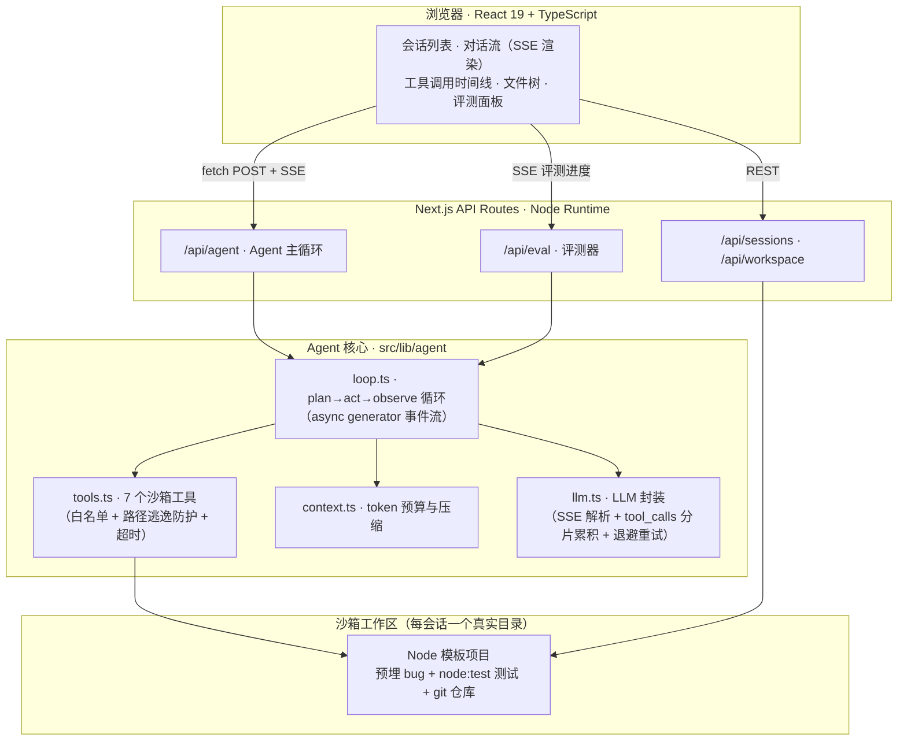

<div align="center">

# 🤖 DevMate — Browser-based Coding Agent

**在浏览器里给 Agent 一个编码任务，它自己读代码、改代码、跑测试、提交 Git —— 全程流式可视化。**

Next.js 16 · React 19 · TypeScript · LLM Tool Calling · SSE Streaming

</div>

---

## 这是什么？

DevMate 是一个从零实现的 **Coding Agent 全栈应用**，对标 Claude Code / Codex / CodeBuddy 的核心执行链路，做成「麻雀虽小、五脏俱全」的浏览器产品：

> 你输入「修复 mathutils.js 中的 bug，使全部测试通过并提交」，
> Agent 先**规划任务**，然后通过**工具调用**在沙箱里读文件、检索代码、写代码、运行测试、提交 Git，
> 每一步都以**流式**呈现在界面上 —— 你能看到它在想什么、调了什么工具、改了哪行代码。

它不是 LangChain Demo，也不是 API 套壳：Agent 循环、工具沙箱、上下文压缩、评测体系全部手写，约 **2000 行核心代码**。

## 核心特性

| 能力 | 实现 |
|---|---|
| 🧭 **任务规划** | 结构化输出（JSON steps）先生成 3-6 步计划，前端步骤清单可视化 |
| 🔧 **工具调用** | 7 个沙箱工具：`list_files` / `read_file` / `write_file` / `search_code` / `run_command` / `run_tests` / `git_operation` |
| 📡 **流式交互** | 服务端 SSE 事件流，token 级增量渲染 + 工具调用时间线交织输出 |
| 🗜️ **上下文管理** | token 预算控制，超限时自动压缩早期工具结果，压缩事件可观测 |
| 🛡️ **沙箱安全** | 每会话独立目录 + 独立 Git 仓库，路径规范化防 `..` 逃逸，命令白名单，子进程超时强杀 |
| ✅ **效果评估** | 内置 4 任务评测集（修 bug / 加功能 / 重构 / 写文档），断言最终文件与测试结果，输出通过率报告 |
| 🧪 **工程质量** | 15 个单元测试覆盖沙箱安全 / 工具执行 / 上下文压缩 |
| 🔁 **限流韧性** | LLM 层指数退避重试（429/5xx），长评测链路不中断 |

## 实测结果

> 2026-09-26 在 Windows 11 / Node 22 / bun 1.4.2 上实际运行（非编造），
> 模型 `qwen3.8-max`（OpenAI 兼容接口）。

```
单元测试：15/15 通过（bun test tests/agent.test.ts）

评测集：4/4 任务通过，通过率 100%，总用时 213s（bun scripts/run-eval.ts）
  ✓ 修复 mathutils 使全部测试通过   6 步 / 7 次工具调用 / 31.5s
  ✓ 新增 clamp 函数并补测试        10 步 / 11 次工具调用 / 73.5s
  ✓ fibonacci 重构为迭代实现        7 步 / 7 次工具调用 / 47.4s
  ✓ 为 README 补充使用说明          6 步 / 7 次工具调用 / 41.9s

端到端：规划 → 流式输出 → 工具调用 → 测试验证 → Git 提交，全链路验证通过
```

评测过程中的真实产物示例（Agent 自主完成，非人工修改）：

```
[工具] read_file {"path":"mathutils.js"}      → 发现 average 分母 off-by-one
[工具] write_file {"path":"mathutils.js",...} → 改 average / fibonacci / maxOf
[工具] run_tests {}                           → exit 0：通过 4 项，失败 0 项
[工具] git_operation {"action":"commit",...}  → [main 880d3c8] fix(mathutils): ...
```

## 架构



### Agent 执行循环

```typescript
// src/lib/agent/loop.ts（简化示意）
for (step = 1; step <= maxSteps; step++) {
  compressContext(messages)                      // 1. 上下文预算控制
  const res = await chatStream(messages, TOOLS,  // 2. LLM + Tool Calling（流式）
    { onToken: t => queue.push({type:'token', text:t}) })
  if (!res.toolCalls.length)                     // 3. 无工具调用 → 输出最终总结
    return queue.push({ type:'final', summary: res.content })
  for (const tc of res.toolCalls) {
    queue.push({ type:'tool_call', ... })        // 4. 执行工具并回填结果
    const result = await executeTool(ctx, tc)
    messages.push({ role:'tool', content: result })
  }
}
```

**关键设计**：LLM 流式回调无法直接在 async generator 中 `yield`，因此采用「**事件队列 + 并发泵**」模式——回调实时 push 事件、外层 generator 实时消费，保证 token 流与工具事件在同一事件流中交织输出。

## 快速开始

```bash
git clone https://github.com/SeupLio/devmate-coding-agent.git
cd devmate-coding-agent
bun install
bun run db:push     # 初始化 SQLite（Prisma）
bun run dev         # http://localhost:3000
```

### 配置 LLM（首次运行必做）

项目支持两种 LLM 接入，通过环境变量 `LLM_PROVIDER` 切换（默认 `openai`）：

```bash
cp .env.example .env   # 然后填入你的密钥
```

```bash
# 方式一（推荐）：任意 OpenAI 兼容厂商 —— DeepSeek / 通义千问 / OpenAI 官方 / vLLM / Ollama
LLM_PROVIDER=openai
OPENAI_BASE_URL=https://api.deepseek.com      # 默认 https://api.openai.com/v1
OPENAI_API_KEY=sk-xxxxxx
OPENAI_MODEL=deepseek-chat                    # 默认 gpt-4o-mini

# 智谱开放平台（GLM-4-Flash 有免费额度）
LLM_PROVIDER=openai
OPENAI_BASE_URL=https://open.bigmodel.cn/api/paas/v4
OPENAI_API_KEY=你的Key
OPENAI_MODEL=glm-4-flash

# 方式二：智谱清言内部 SDK（仅在智谱沙箱内有凭证时可用）
LLM_PROVIDER=zai
```

> Windows 用户请先安装 [Bun](https://bun.sh)（或 `npm i -g bun`）与 Git，
> 并把 `C:\Program Files\Git\usr\bin` 加入 PATH，否则 Agent 的 `ls / cat / grep` 会报"找不到命令"。

在页面输入任务（或点击快捷任务），观察 Agent 全过程：

- **中间对话区**：任务规划清单 → 流式思考文本 → 可展开的工具调用卡片（参数/结果）
- **右侧工作区**：实时文件树 + 代码查看
- **右侧评测页签**：运行 4 任务评测集，查看通过率报告

命令行（不依赖界面）：

```bash
bun test tests/agent.test.ts                          # 单元测试
bun scripts/run-agent.ts "修复 mathutils.js 的 bug 并提交"   # 单任务
bun scripts/run-eval.ts                               # 全量评测
```

## 评测怎么做的？

「Agent 说它做完了」不算数 —— 评测器只看**最终事实**：

1. 每个任务在**全新沙箱副本**上运行（杜绝状态泄漏）；
2. 断言分两类：**测试执行断言**（`node --test` exit code）与**文件内容断言**（如「`mathutils.js` 含迭代实现」）；
3. 工程细节：若 Agent 在总结阶段被限流打断，但任务产物已通过全部内容断言，**不误判为失败**。

初始沙箱是一个故意埋了 3 类 bug 的数学工具库：`average` 分母 off-by-one、`fibonacci` 低效递归 + 边界错误（性能断言强制要求迭代实现）、`maxOf` 未导出。换掉 `assets/template-project/` 即可评测你自己的项目。

## 目录结构

```
src/
  app/
    page.tsx                  # 单页应用（会话 / 对话 / 工作区 / 评测）
    api/agent/route.ts        # Agent SSE 接口
    api/eval/route.ts         # 评测 SSE 接口
    api/sessions/...          # 会话 CRUD
    api/workspace/[id]/...    # 文件树 / 文件内容
  lib/agent/                   # Agent 核心
    loop.ts                   # 执行循环（事件队列 + 并发泵）
    tools.ts                  # 7 个沙箱工具
    context.ts                # 上下文预算与压缩
    llm.ts                    # LLM 封装（重试 + SSE 解析）
    prompts.ts                # 系统提示词
    workspace.ts              # 会话沙箱管理
  lib/eval/                    # 评测集 + 执行器
  components/agent/            # ToolCallCard / WorkspacePanel / EvalPanel
tests/agent.test.ts            # 15 个单元测试
scripts/run-agent.ts           # CLI 单任务入口
scripts/run-eval.ts            # CLI 评测入口
assets/template-project/       # 沙箱模板项目（预埋 bug）
```

## 技术选型说明

- **LLM 接入**：所有模型调用集中在 `src/lib/agent/` 下三个文件——`llm.ts`（provider 路由）、`llm.openai.ts`（OpenAI 兼容实现）、`llm.zai.ts`（智谱内部 SDK 实现）。**换 OpenAI / DeepSeek / Qwen 无需改代码，只改环境变量**；新增厂商也只需再加一个同签名模块。
- **为什么手写 Agent 循环而不用 LangChain**：Coding Agent 的核心难点在工具设计、上下文预算与评测，框架把这些藏起来了。手写一遍，才知道 Claude Code 们到底在做什么工程。
- **为什么用 node:test 而不是 jest**：沙箱项目要极简可运行，Node 22 内置测试器零依赖。

## Roadmap

- [ ] diff 视图（变更前后对比）
- [ ] 代码索引升级：AST / 向量检索替代 grep
- [ ] 变异测试：向沙箱注入新 bug，验证评测灵敏度
- [ ] 跨端 WebView 适配（Electron / UE / Maya 内嵌面板）
- [ ] 多模型对比评测报告

## License

MIT
