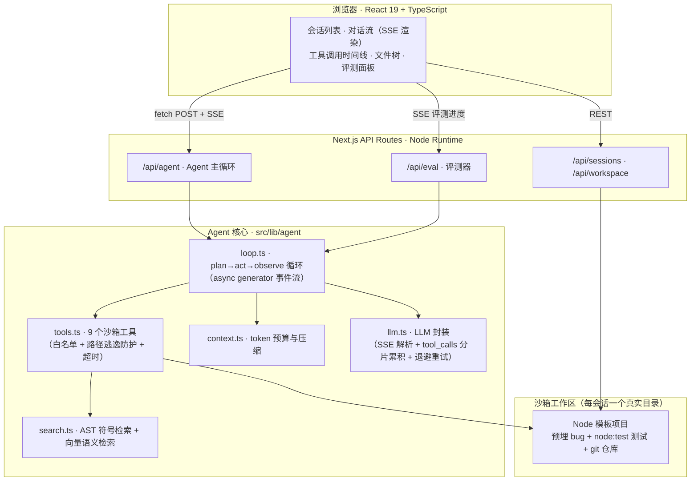

<div align="center">

# 🤖 DevMate — Browser-based Coding Agent

**在浏览器里给 Agent 一个编码任务，它自己读代码、改代码、跑测试、提交 Git —— 全程流式可视化。**

Next.js 16 · React 19 · TypeScript · LLM Tool Calling · SSE Streaming

</div>

---

## 这是什么？

DevMate 是一个从零实现的 **Coding Agent 全栈应用**，对标 Claude Code / Codex / CodeBuddy 的核心执行链路，做成「麻雀虽小、五脏俱全」的浏览器产品：

> 你输入「修复 mathutils.js 中的 bug，使全部测试通过并提交」，
> Agent 先**规划任务**，然后通过**工具调用**在沙箱里读文件、检索代码、写代码、运行测试、提交 Git，
> 每一步都以**流式**呈现在界面上 —— 你能看到它在想什么、调了什么工具、改了哪行代码。

它不是 LangChain Demo，也不是 API 套壳：Agent 循环、工具沙箱、上下文压缩、评测体系全部手写，约 **2000 行核心代码**。

## 核心特性

| 能力 | 实现 |
|---|---|
| 🧭 **任务规划** | 结构化输出（JSON steps）先生成 3-6 步计划，前端步骤清单可视化 |
| ✏️ **精确编辑** | **`edit_file`**（唯一性校验的字符串替换）+ **`multi_edit`**（原子多处替换）—— 对标 Claude Code，不再整文件重写 |
| 📄 **文档产出** | **`generate_docx`**（Word 报告/方案）+ **`generate_pptx`**（PPT 汇报）—— 直接产出真正的 .docx / .pptx 交付物，工作区可下载 |
| 🔧 **工具调用** | **18 个**沙箱工具：`list_files` / `read_file`(offset/limit) / `edit_file` / `multi_edit` / `write_file` / `glob` / `grep` / `search_ast` / `search_semantic` / `search_knowledge` / `run_command` / `run_tests` / `git_operation` / `review_diff` / `task` / `todo_write` / `generate_docx` / `generate_pptx` |
| 🔌 **MCP 工具生态** | **运行时动态发现**外部 MCP 服务器的工具（`mcp__<server>__<tool>`），工具层不再写死；未配置时零开销 |
| ⚡ **分级并发调度** | 工具按**副作用**分级：只读工具（read/grep/glob/AST/语义）并发执行，写操作与命令串行（避免互相踩）；MCP 工具需声明 `readOnlyHint` 才并发 |
| 🧩 **子 Agent 委派** | `task` 工具把「调研型」子任务丢进**独立上下文**，只回传结论 —— 主上下文不被一堆文件全文挤爆。子 Agent 强制只用只读工具且**不能再派子 Agent**（防递归） |
| 🔍 **代码评审** | `review_diff` 工具 + 评审面板。**两层设计**：确定性静态检查（硬编码密钥 / 调试残留 / 改实现没改测试 / 删断言）+ LLM 语义评审（正确性 / 边界 / 安全 / 性能 / API 设计）。让模型去查 `console.log` 既费 token 又会幻觉，所以能确定性判断的事不问 LLM |
| 📚 **知识库检索（RAG）** | `search_knowledge` 工具检索工作区 `knowledge/` 里的团队文档（规范 / 架构 / FAQ）。与代码检索互补：`search_semantic` 找**代码**，`search_knowledge` 找**文档**。离线 TF-IDF，零依赖可复现 |
| 🔀 **VCS 抽象层** | `VcsProvider` 接口 + `GitProvider`（完整）+ `PerforceProvider`（P4 命令映射，**未在真实 P4 环境验证**）。`VCS_PROVIDER=perforce` 切换 —— 为 JD 点名的「P4 管理」留口 |
| 🖥 **跨端 WebView** | 宿主探测（浏览器 / Electron / UE / Maya）+ 统一桥接（剪贴板 / 打开文件 / 通知 / 主题）+ **显式降级**（能力缺失返回原因，不静默失败）。探测函数是纯函数，可用假 global 单测四种宿主 |
| 🗜 **摘要式上下文压缩** | 超预算时用 LLM 把旧工具结果提炼成结构化事实（已确认事实 / 已改文件 / 关键位置 / 待办），只丢原文不丢信息；LLM 不可用时自动退回占位符方案 |
| ✅ **CI 门禁** | GitHub Actions：typecheck + 136 条单测 + 生产构建。定义在 `docs/ci.yml`（**启用需 token 具备 `workflow` scope**，见文件头说明） |
| 🧠 **思考可视化** | 推理模型的思考过程**流式**输出为独立折叠块，可在界面**一键显示/隐藏**（默认显示，避免"卡住不动"的错觉） |
| ⚡ **按需规划** | 规划是一次完整 LLM 往返；`auto` 模式下短任务自动跳过（「重构斐波那契为迭代」不再空等一整个回合），界面可切 自动/开/关 |
| 🔎 **三层检索** | `glob` 找文件 · `grep` 找文本（输出模式/glob 过滤/上下文行） · **`search_ast`** 答结构问题（谁定义/谁调用） · **`search_semantic`** 按语义召回（TF-IDF 向量余弦） |
| ✅ **任务清单** | **`todo_write`** 结构化清单 + 前端面板实时展示进度（对标 TodoWrite） |
| 🧠 **项目记忆** | 沙箱内 **`DEVmate.md`** 自动注入系统提示（对标 `CLAUDE.md`），交代项目约定与常用命令 |
| 📡 **流式交互** | 服务端 SSE 事件流，token 级增量渲染 + 工具调用时间线交织输出 |
| 🗜️ **上下文管理** | token 预算控制，超限时自动压缩早期工具结果，压缩事件可观测 |
| 🛡️ **沙箱安全** | 每会话独立目录 + 独立 Git 仓库，路径规范化防 `..` 逃逸，命令白名单，子进程超时强杀 |
| 📊 **效果评估** | 五层评测：单元测试 + 常规任务 + held-out 任务 + 难任务集（多文件/长链路/环境反馈）+ 对照实验 |
| 🌍 **真实任务基准** | **SWE-bench 式**：从真实开源仓库的**真实修复提交**自动构建任务，FAIL_TO_PASS / PASS_TO_PASS 由机器推导验证（见 [docs/BENCHMARK.md](docs/BENCHMARK.md)） |
| 🔬 **评测自检** | 变异测试攻击评测器本身：**11 个变异体**检出率 100%；发现并修复「删测试即可通过」「伪造期望值自洽」两类作弊盲区 |
| 🩺 **失败诊断** | 失败模式分类：把「没通过」归类为 8 种可枚举模式（未改动 / 未验证 / 超步数 / 作弊 / API 异常 …），附证据与改进建议 |
| 🧪 **工程质量** | **157 个**单元测试覆盖沙箱安全 / 工具执行 / 检索 / 编辑 / 上下文压缩 / 防作弊 / 失败分类 / 评测灵敏度 / 权限记忆 / 对话导航 |
| 📌 **粘底滚动** | 流式输出自动跟随最新消息，用户往上翻阅时**不打断**；解除跟随后显示「回到底部」按钮（原来每个 token 都触发平滑滚动，动画互相打架导致"看不到新消息"） |
| 🔁 **审批记忆** | 审批卡片可勾选「以后同类操作不再询问」→ 记进**会话级 allow 规则**。⚠️ 破坏性命令（`rm -rf`）与敏感文件仍在更前置的步骤被拦截，「记住」不会关掉这些闸门 |
| 🧭 **对话节点导航** | 把每轮「提问 / 回复」标成可跳转节点，点击滚动到对应位置，带 scrollspy 高亮当前节点 —— 长对话里不用一路往上翻 |
| 🛒 **电商服务商场景** | 把 Agent 能力迁移到电商业务，形成**从原始数据到可执行清单**的闭环：**数据清洗**（多种写法归一 / 异常值拦截 / 去重留痕 / CSV 结构性问题检出）→ **7 维标签打标**（带判定口径、置信度、复核标记）→ **经营诊断 + 任务推荐**（按「影响÷难度」排序）→ **话术生成 + SOP 硬红线质检** → **纠错回流**（归因到规则迭代）。含业务知识库 RAG、**Prompt 变体真实对比**（3 变体 × N 轮重复取均值，实测三者 0.89~0.93 且违规率 0%）、可交互「服务商工作台」面板与批量 CLI |
| 📏 **打标评测体系** | **有 ground truth 才算得准不准**：24 条回归集（锁定口径）+ 10 条挑战集（用真实口语变体为难规则，暴露 3 处已知能力边界）；指标含 P/R/F1、**Cohen's Kappa**（口径可交接性）、**P@K / NDCG@K**（优先名单质量）、数据质量四维；阈值可配置 + 网格搜索校准（**如实报告「未达显著、易过拟合」**，不吹嘘调参收益）|
| 🔁 **限流韧性** | LLM 层指数退避重试（429/5xx），长评测链路不中断 |

> ⚠️ **生产落地评估见 [docs/PRODUCTION-READINESS.md](docs/PRODUCTION-READINESS.md)** ——
> 诚实列出当前设计里「demo 级」的部分（尤其是沙箱隔离、权限模型、可观测性）。

## 实测结果

> 2026-09-26 在 Windows 11 / Node 22 / bun 1.4.2 上实际运行（非编造），
> 模型 `qwen3.8-max`（OpenAI 兼容接口）。

```
L1 单元测试：53/53 通过（bun test tests/agent.test.ts）

L2 常规评测集：4/4 通过，100%（bun scripts/run-eval.ts --only default）
  ✓ 修复 mathutils 使全部测试通过
  ✓ 新增 clamp 函数并补测试
  ✓ fibonacci 重构为迭代实现
  ✓ 为 README 补充使用说明

L2 held-out 评测集：4/4 通过，100%（另一个项目 stringutils，断言全部来自预置测试）
  ✓ 修复 slugify    ✓ 修复 camelCase    ✓ 实现 truncate    ✓ 实现 initials

L2 难任务集：3/3 通过，100%（多文件项目 hard-project，bun scripts/run-hard.ts）
  ✓ 修复运算符优先级与一元负号（跨 lexer/parser 定位）   8 步 / 14 次工具调用 / 77s
  ✓ 实现变量赋值与多语句（跨 3 文件长链路）            11 步 / 16 次工具调用 / 125s
  ✓ 生成期望值并修正取模语义（必须运行参考脚本获取反馈） 10 步 / 16 次工具调用 / 103s
  → 平均 9.7 步 / 15.3 次工具调用，约为常规任务的 2 倍

L4 评测灵敏度：基线全通过 + 变异体检出率 100%（11/11，bun scripts/check-sensitivity.ts）
  作弊类 3/3（删空测试、清空 assert、伪造期望值自洽）
  逻辑退化类 8/8（off-by-one、漏导出、性能退化、边界遗漏、上下界写反、优先级、一元负号、取模语义）

端到端：规划 → 流式输出 → 工具调用 → 测试验证 → Git 提交，全链路验证通过
```

### 延迟与速度（实测，含反直觉结论）

用户反馈过「简单任务也要思考很久才出结果」。定位后发现两个真问题：

1. **规划阶段是一次「静默的完整 LLM 调用」** —— 不流式、无回调，这期间界面一片空白；
2. **推理模型的思考内容（`reasoning_content`）根本没被解析** —— 只读了 `delta.content`，
   于是长思考期间前端完全空白，正文突然出现。**这才是「思考特别久」的真身。**

修复后实测（任务：「重构斐波那契数列为迭代实现」）：

| 模式 | 首屏延迟 | 总耗时 | 思考字数 |
|---|---|---|---|
| 深度思考 **开**（默认） | **1.4s** | 81.7s | 6441 |
| 快速模式（`enable_thinking=false`） | 25.4s | **26.9s** | 0 |

**反直觉但诚实**：关掉思考总耗时快约 **3×**，但**首屏反而更慢**（25.4s）——
因为没有思考内容可流式，而首个工具调用要等整轮 LLM 结束才发出。
换句话说：**开思考是「更快看到动静」，关思考是「更快拿到结果」**，两种诉求不同，
所以做成了界面上一键切换，而不是替你选死。

另外 `plan=auto`（短任务跳过规划）实测**并不必然更快**：单样本下
auto 116s vs 强制规划 65s —— 因为缺了规划，Agent 的思考量翻倍（10233 vs 5208 字）。
所以它只是**可选项**，真正解决「感觉慢」的是思考流式化。

评测过程中的真实产物示例（Agent 自主完成，非人工修改）：

```
[工具] read_file {"path":"mathutils.js"}      → 发现 average 分母 off-by-one
[工具] write_file {"path":"mathutils.js",...} → 改 average / fibonacci / maxOf
[工具] run_tests {}                           → exit 0：通过 4 项，失败 0 项
[工具] git_operation {"action":"commit",...}  → [main 880d3c8] fix(mathutils): ...
```

## 对照实验：这些数字说明了什么，以及没说明什么

「通过率 100%」本身没有说服力 —— 它可能是系统强，也可能是题目太简单。
为此做了一组**对照实验（ablation）**：固定任务集，只改变 Agent 的一个能力维度。

### 强模型（qwen3.8-max）× 4 个常规任务

| 实验组 | 通过率 | 平均步数 | 平均工具调用 | 平均耗时 | 平均 token |
|---|---|---|---|---|---|
| A · 完整配置 | 100% (4/4) | 7.8 | 8.5 | 50.4s | **11322** |
| B · 无任务规划 | 100% (4/4) | 6.0 | 6.8 | 32.4s | 6545 |
| C · 无自我验证（去掉 run_tests） | 100% (4/4) | 6.0 | 6.5 | 38.4s | 6831 |
| D · 无代码检索（去掉 grep） | 100% (4/4) | 7.0 | 7.5 | 46.6s | 8837 |
| E · 无上下文压缩 | 100% (4/4) | 7.0 | 7.8 | 43.7s | 8570 |
| F · 裸模型（无工具·单次输出） | 100% (4/4) | 1.0 | 0.0 | 32.0s | **2086** |

**结论（诚实版）**：在这批任务上，**六个组全部 100% 通过** —— 规划、代码检索、上下文压缩
甚至「完全不使用工具」都没有让通过率产生差异。唯一显著差异是**成本**：
完整配置消耗的 token 是裸模型的 **5.4 倍**。

也就是说：**当前任务集太简单，测不出 Agent 范式的价值**。
单文件、单 bug、`node --test` 秒级完成的任务，强模型一次性输出就能做对。
这不是评测的胜利，而是评测**区分度不足**的证据。

### 弱模型（qwen3.5-flash）× 同一批任务 —— 差异出现了

| 实验组 | 通过率 | 平均步数 | 平均工具调用 | 平均 token |
|---|---|---|---|---|
| A · 完整配置 | **75% (3/4)** | 6.5 | 5.8 | 6156 |
| C · 无自我验证（去掉 run_tests） | **50% (2/4)** | 7.8 | 7.0 | **11698** |
| F · 裸模型（无工具·单次输出） | **50% (2/4)** | 1.0 | 0.0 | 3771 |

**结论**：模型能力不足时，「改完自己跑测试确认」这一步带来 **+25pp 通过率**（50% → 75%）。
有意思的是 C 组反而更贵（11698 vs 6156 token）—— 因为不跑测试，Agent 只能反复试错。

**这才是 Agent 范式价值的证据**：它不是在模型已经能做对时更省，而是在模型**不确定**时，
通过环境反馈把错误纠回来。

### held-out 泛化

| 实验组 | 通过率（held-out 4 任务） |
|---|---|
| A · 完整配置 | 100% (4/4) |
| F · 裸模型 | 100% (4/4) |

换到另一个项目（stringutils）、断言全部来自预置测试，结论与常规集一致 ——
**说明结论可迁移，不是特定任务集的偶然结果**。

### 重复运行方差（稳定性）

强模型 × 完整配置 × 4 任务 × **3 轮** = 12 次运行：

```
通过率：100%（12/12）｜平均步数 6.6｜平均工具调用 7.3｜平均耗时 44.6s｜平均 token 8943
```

三轮全部通过，**未观察到方差** —— 说明强模型在这批任务上表现稳定，
单次通过率不是运气。但这也从另一面印证了「任务太简单」：稳定地简单。

### 已知局限

1. 常规/held-out 任务仍是单文件、小规模，区分度不足（上表已量化）。
   **已通过新增难任务集（多文件 `hard-project`、跨文件追踪、必须运行脚本获取环境反馈）缓解**，
   但难任务集仅 3 个、仍是自制小项目。
2. 这不是 SWE-bench：真正的 SWE-bench 用真实 GitHub issue + 真实仓库 + Docker，
   本项目只是**方法论复刻**（预置失败测试 + held-out + 对照 + 变异 + 失败分类），不能与 SWE-bench 分数类比。
3. 样本量小（4 + 4 + 3 任务），单次通过率不代表稳定通过率，因此另做了重复运行观察方差。
4. 无多框架对照（未对照 LangChain 等）。
5. 失败模式分类是**启发式优先级规则**，给出的是首要归因而非唯一原因。

完整方法论见 **[docs/EVALUATION.md](docs/EVALUATION.md)**；原始报告见
`ablation-*.txt`、`sensitivity-report.txt`、`hard-report.txt`。

## 架构



### Agent 执行循环

```typescript
// src/lib/agent/loop.ts（简化示意）
for (step = 1; step <= maxSteps; step++) {
  compressContext(messages)                      // 1. 上下文预算控制
  const res = await chatStream(messages, TOOLS,  // 2. LLM + Tool Calling（流式）
    { onToken: t => queue.push({type:'token', text:t}) })
  if (!res.toolCalls.length)                     // 3. 无工具调用 → 输出最终总结
    return queue.push({ type:'final', summary: res.content })
  for (const tc of res.toolCalls) {
    queue.push({ type:'tool_call', ... })        // 4. 执行工具并回填结果
    const result = await executeTool(ctx, tc)
    messages.push({ role:'tool', content: result })
  }
}
```

**关键设计**：LLM 流式回调无法直接在 async generator 中 `yield`，因此采用「**事件队列 + 并发泵**」模式——回调实时 push 事件、外层 generator 实时消费，保证 token 流与工具事件在同一事件流中交织输出。

## 快速开始

```bash
git clone https://github.com/SeupLio/devmate-coding-agent.git
cd devmate-coding-agent
bun install
bun run db:push     # 初始化 SQLite（Prisma）
bun run dev         # http://localhost:3000
```

### 先跑这个：一键本地 Demo（不需要浏览器）

配好 `.env` 之后，**一行命令就能看完整链路**：

```bash
bun run demo
```

**想先确认「真的能跑」？** 一条命令，不依赖任何外部服务：

```bash
bun run e2e    # 端到端自检：57 项断言（清洗/打标/诊断/CSV/知识库/纠错回流）
```

它会真实跑一遍「修 bug → 跑测试 → 提交」，并依次展示：

```
═══ DevMate 本地 Demo ═══
  模型    qwen3.8-max
  任务    修复 mathutils.js 中的 bug，使全部测试通过，然后提交。
✓ 沙箱已就绪（模板项目已复制进去）

─── 开始执行 ───
  ▸ 规划（3 步）
  [1] → read_file {"path":"mathutils.js"}
      ✓      1| /**
  [5] → edit_file {"path":"mathutils.js",...}
      ⏸ 需要确认：edit_file（write）—— 默认模式：write 类操作需要确认
        已自动放行（Demo 行为；真实使用由人工决定）
  [12] → run_tests {}
      ✓ 测试执行完成（exit 0）：通过 4 项，失败 0 项。
  [13] → git_operation {"action":"commit",...}
      ✓ 提交成功：[main f147e95] fix: 修复 mathutils.js 中的 bug

─── 执行结果 ───
  步数 14｜工具调用 14｜审批询问 8 次
  trace 1e592662｜30.7s｜83561 tokens（api）｜llm 29.0s / tool 1.5s
```

> Demo 会自动放行审批（否则要人工点），但**每次都把询问打印出来**，
> 让你看到权限闸门真的在工作。浏览器 UI 里则是弹卡片由你决定。

### 配置 LLM（首次运行必做）

项目支持两种 LLM 接入，通过环境变量 `LLM_PROVIDER` 切换（默认 `openai`）：

```bash
cp .env.example .env   # 然后填入你的密钥
```

```bash
# 方式一（推荐）：任意 OpenAI 兼容厂商 —— DeepSeek / 通义千问 / OpenAI 官方 / vLLM / Ollama
LLM_PROVIDER=openai
OPENAI_BASE_URL=https://api.deepseek.com      # 默认 https://api.openai.com/v1
OPENAI_API_KEY=sk-xxxxxx
OPENAI_MODEL=deepseek-chat                    # 默认 gpt-4o-mini

# 智谱开放平台（GLM-4-Flash 有免费额度）
LLM_PROVIDER=openai
OPENAI_BASE_URL=https://open.bigmodel.cn/api/paas/v4
OPENAI_API_KEY=你的Key
OPENAI_MODEL=glm-4-flash

# 方式二：智谱清言内部 SDK（仅在智谱沙箱内有凭证时可用）
LLM_PROVIDER=zai
```

> Windows 用户请先安装 [Bun](https://bun.sh)（或 `npm i -g bun`）与 Git，
> 并把 `C:\Program Files\Git\usr\bin` 加入 PATH，否则 Agent 的 `ls / cat / grep` 会报"找不到命令"。

在页面输入任务（或点击快捷任务），观察 Agent 全过程：

- **中间对话区**：任务规划清单 → 流式思考文本 → 可展开的工具调用卡片（参数/结果）
- **右侧工作区**：实时文件树 + 代码查看
- **右侧评测页签**：运行 4 任务评测集，查看通过率报告

命令行（不依赖界面）：

```bash
bun test tests/agent.test.ts                 # L1 单元测试（67 条）
bun scripts/run-agent.ts "修复 mathutils.js 的 bug 并提交"   # 单任务
bun scripts/run-eval.ts --only default       # L2 常规评测集
bun scripts/run-eval.ts --only holdout       # L2 held-out 评测集
bun scripts/run-hard.ts                      # L2 难任务集（含失败模式报告）
bun scripts/run-ablation.ts                  # L3 对照实验
bun scripts/check-sensitivity.ts             # L4 评测灵敏度（不需要 LLM）
```

## 评测怎么做的？

「Agent 说它做完了」不算数 —— 评测器只看**最终事实**。整套评测分五层，
详细方法论见 **[docs/EVALUATION.md](docs/EVALUATION.md)**：

| 层 | 手段 | 回答什么问题 | 需要 LLM |
|---|---|---|---|
| L1 | **单元测试**（67 条） | 代码有没有坏？沙箱安全、工具、检索、压缩对不对？ | 否 |
| L2 | **任务评测集**（4 常规 + 4 held-out + 3 难任务） | 端到端链路能不能跑通？能否泛化？跨文件任务行不行？ | 是 |
| L3 | **对照实验**（7 组 + 裸模型） | 每个能力维度各自贡献多少？ | 是 |
| L4 | **评测灵敏度**（11 变异体） | 评测本身是不是太松？ | **否** |
| L5 | **失败模式分类** | 没通过的任务**为什么**没通过？ | 否 |

几个关键设计：

1. **沙箱隔离**：每个任务在**全新沙箱副本**上运行（含独立 Git 仓库），杜绝状态泄漏；
2. **断言来源分层**：常规集用「测试退出码 + 文件内容」；**held-out 与难任务集 100% 用预置测试的退出码**
   （SWE-bench 式 FAIL_TO_PASS），不含任何按实现写的正则，因此无法靠迁就断言刷分；
3. **防作弊**：额外断言「原有测试用例未被删减」，以及难任务的「`expected.json` 必须等于参考实现真值」
   —— 否则 Agent 只要删测试、或把期望值写成自己的错误输出，就能让测试自洽地通过
   （这两个盲区都是 L4 发现的，不是想出来的）；
4. **灵敏度自检**：拿已知正确的参考解故意破坏成 11 个变异体，验证评测能否全部检出；
   等价变异体（语义不变）必须剔除，否则会误判评测有洞；
5. **失败可归因**：把失败归类为 8 种模式（未改动 / 未验证 / 超步数 / 作弊 / API 异常 …），
   附证据与改进建议，让评测从「打分器」变成「诊断器」；
6. **容错**：若 Agent 在总结阶段被限流打断，但任务产物已通过全部断言，**不误判为失败**。

沙箱模板有三套：`template-project`（mathutils，单文件 3 类 bug）、`holdout-project`
（stringutils，另一域、预置失败测试）、`hard-project`（多文件表达式计算器，含必须运行脚本才能获得期望值的任务）。换掉对应目录即可评测你自己的项目。

## 外部权威基准：用别人的尺子量自己

项目内的评测任务是我自己扫出来的。为了能被**外部复核**，另接了两个权威基准
（题目与标准答案均由外部定义）：

### BFCL v4（Berkeley Function Calling Leaderboard）

函数调用的事实标准。实测 **200 题**（模型 `qwen3.8-max`）：

| 类别 | 原生通道 | MCP 通道 | 考什么 |
|---|---|---|---|
| `simple_javascript` | 66.0% | 60.0% | 单函数、参数抽取 |
| `multiple` | 58.0% | 57.5% | 多函数里选对一个 |
| `parallel` | **84.0%** | 82.5% | 一次调**多个**函数（并发调度的前提） |
| `irrelevance` | **92.0%** | —— | **不该调时别调** |
| **总体** | **75.0%** (150/200) | **66.7%** (80/120) | |

### Aider polyglot-benchmark（JavaScript，Exercism 题库）

Aider 官方排行榜用的基准，测试由 Exercism 定义。49 题，`jest` 判分。
实测 **解决率 93.9%（46/49）**，平均 19.5 步 / 158s。
未通过：`bowling` 23/30、`two-bucket` 5/10、`rational-numbers` 35/36。
⚠️ 关键对齐：Exercism 原版测试是「逐步解锁」（只有第一条是 `test`，其余 `xtest`），
**不启用的话模型什么都不做也能全绿** —— harness 会先把测试全部启用。

> 完整的「怎么跑的 / 判分器与官方的差异 / 跑不了哪些 / 踩了什么坑」
> 见 **[docs/EXTERNAL-BENCHMARKS.md](docs/EXTERNAL-BENCHMARKS.md)**。
> 其中记录了一个**会让结论完全反转的 harness bug**（MCP 工具名点号被替换成下划线，
> 导致 `parallel` 从 84% 假摔到 36%）。

```bash
bun run bfcl simple_javascript,multiple,parallel,irrelevance 50   # BFCL 原生通道
bun run bfcl simple_javascript,multiple,parallel 40 mcp           # BFCL MCP 通道
bun run polyglot 49 6                                             # polyglot 全量
```

## 真实任务基准（对标 SWE-bench 的方法论）

上面五层评测有个致命短板：**题目全是我自己造的**——我出题、我写断言、我判分，
只能证明「链路能跑通」，不能证明「在真实代码上能干成事」。

所以另建了一套**真实任务基准**（`src/lib/bench/`），把评测重建在
**真实开源仓库的真实修复提交**上：

```
真实修复提交 fix
  ├─ base = fix 的父提交 → 拉真实仓库快照（codeload）
  ├─ 把 fix 里的**测试文件**覆盖到 base（Agent 看不到）
  ├─ 阶段1 跑测试 → 失败集合 = FAIL_TO_PASS 候选
  └─ 阶段2 套用 fix 的**源码**改动 → 必须全通过
        └─ 两段都成立才收录 → VALID 任务
```

**判据是机器跑出来的，不是我写的** —— 断言来自上游仓库，且在 base 上确实失败，
所以既不能「迁就断言」，也不会出现「本来就能过」的伪任务。

当前收录 6 条（来自 `proxy-from-env` 与 `cel-js`），并已实测跑分：

| 任务 | 仓库 | 出处 | FAIL_TO_PASS | PASS_TO_PASS |
|---|---|---|---|---|
| `pfe-whatwg-url` | Rob--W/proxy-from-env | issue #32 | 5 | 120 |
| `pfe-drop-npm-config` | Rob--W/proxy-from-env | issue #13 | 5 | 121 |
| `pfe-esm-migration` | Rob--W/proxy-from-env | issue #18 | 1 | 0 |
| `celjs-source-ranges` | marcbachmann/cel-js | issue #90 | 5 | 7 |
| `celjs-error-compat` | marcbachmann/cel-js | 提交推导 | 4 | 106 |
| `celjs-diagnostics` | marcbachmann/cel-js | 提交推导 | 7 | 0 |

**五条设计原则的落地**：

| 原则 | 落地方式 |
|---|---|
| 真实性 | 任务来自真实仓库真实提交；`provenance` 强制记录出处，自造任务必须标 `synthetic` |
| 可验证性 | FAIL_TO_PASS/PASS_TO_PASS 机器推导；开放式任务才用 LLM Judge（带 rubric + 强制引用原文 + 温度 0） |
| 防泄露 | 隐藏测试**只在评测时拉取**（Agent 沙箱里没有）+ `collectedAt`/`modelCutoff` 时间切分 + 污染风险单列 |
| 多维度 | 除成败外，还报 **工具使用 / 效率 / 安全 / 推理质量**，并按难度·类别·出处三向分组 |
| 抗游戏性 | 测试不在沙箱里（没法针对断言写死）+ 判据来自上游测试 + 任务池可增量扩充 |

复现：

```bash
export GITHUB_TOKEN=xxx            # 需要访问 api.github.com 与 codeload.github.com
export BENCH_NODE_BIN=$(which node) # 跑 node --test 用
bun scripts/bench-build.ts          # 构建并验证真实任务 → benchmarks/real-tasks.json
bun scripts/bench-run.ts            # 跑分 → benchmarks/bench-report.txt / .json
```

> ⚠️ **诚实说明**：这套基准比旧的好，但**仍然不等于 SWE-bench**——
> 样本只有 6 条（无统计显著性）、PASS_TO_PASS 只覆盖改动到的测试文件（非全量套件）、
> 没有 Docker 隔离。完整局限清单见 **[docs/BENCHMARK.md](docs/BENCHMARK.md)** 第 3 节。
> 它能支撑的说法是「在 2 个真实开源库的 6 个真实修复任务上表现如何」，
> **不能**支撑「编码能力是 X 分」。

## MCP：让工具层不再写死

内置工具再多也是「我写死的」。接入 **MCP（Model Context Protocol）** 后，
Agent 启动时会连上外部工具服务器、**在运行时发现工具**并调用：

```bash
cp mcp.servers.json.example mcp.servers.json   # 或设置 MCP_SERVERS 环境变量（JSON 数组）
bun scripts/mcp-smoke.ts                       # 端到端冒烟：真实 Agent 循环调用 MCP 工具
```

实测输出：

```
✓ 运行时发现 3 个 MCP 工具：
    mcp__demo__get_time    (readOnly=false)
    mcp__demo__word_count  (readOnly=false)
    mcp__demo__sha256      (readOnly=false)
  · 调用 MCP 工具 mcp__demo__get_time
MCP 工具返回：2026/10/5 17:02:43（Asia/Shanghai）
✓ 冒烟通过：Agent 在运行时发现并成功调用了外部 MCP 工具
```

实现要点（`src/lib/agent/mcp.ts`，零依赖手写）：

- **协议**：stdio 上换行分隔的 JSON-RPC 2.0（**不是** LSP 的 `Content-Length` 分帧）
- **能力**：`initialize` 握手（含版本协商）/ `tools/list` / `tools/call` / 优雅关闭
- **健壮性**：请求超时、进程崩溃感知（把 stderr 带进错误信息）、单服务器失败不影响其余
- **命名空间**：`mcp__<server>__<tool>`，避免与内置工具撞名
- **并发安全**：MCP 工具**默认串行**，只有服务器显式声明 `readOnlyHint: true` 才允许并发

### 分级并发调度

工具执行不再一律串行。按**副作用**分级：

| 类别 | 工具 | 调度 |
|---|---|---|
| 只读 | `read_file` `list_files` `glob` `grep` `search_ast` `search_semantic` | **并发** |
| 有副作用 | `edit_file` `multi_edit` `write_file` `run_command` `run_tests` `git_operation` `todo_write` | 串行 |
| MCP | 外部工具 | 默认串行，声明只读才并发 |

只对「连续的只读调用」并发，且回填结果时**严格按原始顺序**
（OpenAI 协议要求 tool 消息与 tool_calls 顺序一一对应）。

## 可观测性：从「跑完了」到「跑得怎么样」

一次任务 = 一个 **trace**，每次 LLM / 工具调用 = 一个 **span**，
落盘到 `traces/<traceId>.json`。`bun run trace:report` 输出：

```
—— 时间花在哪（瓶颈定位）——
  llm         32.6s   98%  █████████████████████████████
  tool        769ms    2%  █
—— prompt cache ——  命中率 90%（57088/62809）
—— 工具失败率 ——     multi_edit  2 次  失败 2  (100%) ⚠
```

**实测它立刻指出了两个之前完全看不到的问题**：

1. **时间 98% 花在 LLM 往返，工具只占 2%** → 优化方向应该是减少 LLM 往返 /
   提高 cache 命中，而不是优化工具实现。**这个结论直接改变了优化优先级。**
2. **`multi_edit` 失败率 100%** → 查 trace 里的 `error` 属性拿到原因：
   `第 1 处未找到 old_string` —— 不是工具坏了，是模型给的 `old_string`
   与文件内容不匹配（缩进/空白差异），要改的是提示词或工具反馈设计。

**成本账本**优先用 API 真实 usage（`stream_options.include_usage`），
拿不到才退回估算并标注 `usage.source`。并且严格区分两种情况：

| 情况 | 显示 |
|---|---|
| 模型确实免费 | `¥0.0000` |
| 模型不在价格表里 | **「未配置单价」**（绝不显示 ¥0 —— 编造的成本数字比不显示更糟） |

## 权限模型：Agent 会自主写文件，必须有闸门

三层判定（`src/lib/agent/permissions.ts`，纯函数便于测试与回放）：

```
1. 敏感文件？      → 硬 deny（任何模式、任何规则都覆盖不了）
2. 显式 deny 规则？ → deny
3. 破坏性操作？     → ask（bypassPermissions 除外）
4. 显式 allow/ask？ → 按规则（越具体优先级越高）
5. 按权限模式默认策略
```

| 模式 | 读 | 写 | 执行 | 场景 |
|---|---|---|---|---|
| `default` | 放行 | **问** | **问** | 默认，最安全 |
| `acceptEdits` | 放行 | 放行 | **问** | 信任编辑、但仍管命令 |
| `plan` | 放行 | **拒** | **拒** | 只出方案，不动任何东西 |
| `bypassPermissions` | 放行 | 放行 | 放行 | 可信环境（**敏感文件仍然拒**） |

- **敏感文件硬拦截**：`.env*` / `*.pem` / `id_rsa` / `.aws/` / `.ssh/` / `credentials.*` …
  命中即拒且不可覆盖 —— 一次提示注入就能让 Agent 把密钥写进产物
- **破坏性操作按内容判定**（不是按工具名）：`rm -rf` / `git reset --hard` /
  `git push --force` / `DROP TABLE` → 一律 `ask`，即使 `acceptEdits`
- **人在环审批**：判定为 `ask` 时 Agent **暂停**（不是弹个提示继续跑），
  前端弹卡片，用户决定后 `POST /api/approvals` 唤醒；
  **超时按「拒绝」处理**（fail-safe，不是 fail-open）
- **审计日志**：每次判定记 `{时间, 会话, 工具, 风险, 判定, 结果, 理由, 对象}`

实测（`bun run p0:smoke`，10/10 通过）：

```
▶ plan 模式        → run_tests(execute) 被拒；且不产生审批请求（直接拒，不该问）
▶ default 模式     → run_tests / multi_edit×2 / run_command / write_file 触发审批
                     放行后 8 次工具调用确实执行
▶ 可观测性         → trace 落盘、P50/P95、成本与 token、时间按类别归因
```

> 这个冒烟测试当场抓到一个真 bug：Agent「正常完成」的路径（无工具调用直接给答案）
> `return` 时漏了收尾 trace —— 最常见的成功路径反而没有可观测性。已修。

> ⚠️ **权限层不是沙箱**：`run_command` 白名单里有 `node`，而 node 是图灵完备的，
> `node -e "require('fs').writeFileSync(...)"` 依然能绕过路径校验。
> 权限是**纵深防御的一环**，真正的隔离要靠容器。详见
> **[docs/OBSERVABILITY-AND-PERMISSIONS.md](docs/OBSERVABILITY-AND-PERMISSIONS.md)** 第三节。

## 子 Agent 委派：上下文隔离的探索

主 Agent 为了定位一处实现读 10 个文件，这 10 份全文会永久占住主上下文，
把后续推理挤出去（这也是实测里「步数全花在重复读取」的根因之一）。

`task` 工具把这类**调研型**子任务委派出去：

```
主 Agent ──task("找出所有调用 fibonacci 的地方")──▶ 子 Agent（独立上下文）
                                                        │  自己读 N 个文件
                                                        ▼
主 Agent ◀──只收到一段结论 + 消耗统计──────────────────┘
```

设计上的三个硬约束：

| 约束 | 为什么 |
|---|---|
| 子 Agent **只有只读工具** | 它的职责是调研，不是改文件。改文件留在主 Agent 做，避免它背后动主任务的文件 |
| 子 Agent **拿不到 `task` 工具** | 天然防无限递归（不是靠深度计数，是靠工具集） |
| 结论里**明确标注「原文没有进入你的上下文」** | 让主 Agent 知道自己看到的是结论而非原文，该验证时去验证 |

## 摘要式上下文压缩：只丢原文，不丢信息

原来的压缩是把旧工具结果换成占位符：

```
[上下文压缩：原工具结果 3821 字符已省略，前 200 字符摘要：...]
```

**被压掉的信息永久丢失**，Agent 后面还得重新读一遍同一文件 —— 浪费往返。

现在改成让 LLM 提炼成结构化事实：

```
[上下文摘要：以下 12 条较早的工具结果已被 LLM 提炼，原文已丢弃]

## 已确认的事实
- mathutils.js 导出 sum/average/fibonacci，maxOf 未导出
- 测试用 node:test，共 4 条断言
## 已做过的修改
- average 分母 nums.length-1 → nums.length
## 待验证
- fibonacci n=30 的性能断言是否满足
```

三个实现细节：

1. **消息条数不变** —— OpenAI 协议要求 `tool` 消息与 `tool_calls` 一一对应，
   删消息会破坏配对。做法是把摘要写进最早那条工具结果，其余换成指针。
2. **LLM 失败自动退回占位符方案** —— 压缩失败不能让主流程挂掉。
3. 只压「够腾出空间」的那一批，不把全部历史压掉。

## 目录结构

```
src/
  app/
    page.tsx                  # 单页应用（会话 / 对话 / 工作区 / 评测）
    api/agent/route.ts        # Agent SSE 接口
    api/eval/route.ts         # 评测 SSE 接口
    api/sessions/...          # 会话 CRUD
    api/workspace/[id]/route.ts  # 工作区文件树 / 文本预览 / 二进制下载（docx、pptx）
  lib/agent/                   # Agent 核心
    loop.ts                   # 执行循环（事件队列 + 并发泵 + 项目记忆注入 + 按需规划）
    tools.ts                  # 15 个沙箱工具（edit_file/multi_edit/glob/grep/todo/docx/pptx…）
    search.ts                 # AST 符号检索 + TF-IDF 向量语义检索 + glob + grep
    docgen.ts                 # Word(.docx) / PPT(.pptx) 生成（docx + pptxgenjs）
    context.ts                # 上下文预算与压缩
    llm.ts                    # LLM provider 路由
    llm.openai.ts             # OpenAI 兼容实现（流式 + 思考内容 + 网络错误重试）
    llm.zai.ts                # 智谱内部 SDK 实现
    mcp.ts                    # 最小 MCP 客户端（stdio JSON-RPC，零依赖手写）
    mcp-registry.ts           # MCP 服务器注册表（配置加载 / 工具发现 / 调用路由）
    permissions.ts            # 权限模型：风险分级 + 模式 + 规则 + 敏感文件（纯函数）
    approvals.ts              # 人在环审批：挂起 / 决定 / 超时按拒绝 / 审计日志
    subagent.ts               # 子 Agent 委派：独立上下文 + 只读工具集 + 防递归
    review.ts                 # 代码评审：确定性静态检查 + LLM 语义评审（两层）
    knowledge.ts              # 知识库检索（RAG）：Markdown 切块 + TF-IDF + 余弦
    vcs.ts                    # VCS 抽象层：Git 完整实现 + Perforce 命令映射
    trace.ts                  # 可观测性：trace / span / 成本账本 / 聚合分析
    trace-store.ts            # trace 落盘与读取（traces/*.json）
    prompts.ts                # 系统提示词（工具使用纪律）
    workspace.ts              # 会话沙箱管理（独立 Git 仓库 + DEVmate.md 项目记忆）
  lib/eval/                    # 评测体系（自造任务，快、可控，用于回归与消融）
    tasks.ts                  # 常规 4 + held-out 4 + 难任务 3 + 防作弊断言
    runner.ts                 # 评测执行器（运行配置 / 重复轮次 / 失败分类）
    ablation.ts               # 对照实验（7 组 + 裸模型执行器）
    sensitivity.ts            # 评测灵敏度检查（变异测试，11 变异体，不需要 LLM）
    failure-modes.ts          # 失败模式分类（信号 → 8 种模式 + 证据 + 建议）
  lib/bench/                   # 真实任务基准（对标 SWE-bench 方法论）
    types.ts                  # 任务/结果模型（provenance、隐藏测试、五维评分）
    github.ts                 # 从 api.github.com / codeload 拉 issue / 提交 / 仓库快照
    builder.ts                # 两阶段验证：推导 FAIL_TO_PASS / PASS_TO_PASS
    registry.ts               # 真实任务种子（仓库 + 修复提交 + issue）
    runner.ts                 # 跑 Agent + 隐藏测试判定 + 多维打分
    report.ts                 # 按难度/类别/出处分组 + 污染风险 + 失败模式
    judge.ts                  # 开放式任务的 LLM Judge（rubric + 强制引用原文）
    bfcl.ts                   # ★ BFCL v4 适配 + 判分器（Berkeley 函数调用权威基准）
    polyglot.ts               # ★ Aider polyglot-benchmark（Exercism JS）适配
  lib/ecom/                     # ★ 电商服务商垂直场景
    thresholds.ts             # 判定阈值单一来源（两条线三档 + 类目预设）
    cleaning.ts               # 数据清洗（多种写法归一 / 异常值拦截 / 去重留痕）
    pipeline.ts               # CSV 导入导出 + 全链路（清洗→打标→诊断）
    golden.ts                 # 金标准：24 条回归集 + 10 条挑战集（评测的地基）
    metrics.ts                # 指标库：P/R/F1 / Kappa / P@K / NDCG@K / 数据质量四维
    evaluate.ts               # 评测引擎 + 阈值网格搜索校准
    taxonomy.ts               # 7 维标签体系（含判定口径）
    tagging.ts                # 打标引擎（规则优先 + 置信度 + 可解释）
    diagnosis.ts              # 经营诊断 + 任务推荐（按影响/难度排序）
    script.ts                 # 话术生成 + 质检 + Prompt 变体对比
    tag-store.ts              # 打标纠错回流（归因 → 规则迭代依据）
    demo-data.ts              # 演示数据（合成，字段结构可对接数仓）
  lib/host/
    bridge.ts                 # ★ 跨端 WebView 宿主适配（浏览器/Electron/UE/Maya）
  lib/hooks/
    use-stick-to-bottom.ts    # ★ 粘底滚动（流式跟随 + 用户上翻不打断）
  components/agent/            # ToolCallCard / WorkspacePanel / EvalPanel / ReviewPanel
                               # / HostBadge / ConversationNav（对话节点导航）
tests/agent.test.ts            # 157 个单元测试
scripts/run-agent.ts           # CLI 单任务入口
scripts/run-eval.ts            # CLI 评测入口（--only default|holdout|hard, --repeat N）
scripts/run-hard.ts            # CLI 难任务集评测（含失败模式报告）
scripts/run-ablation.ts        # CLI 对照实验入口
scripts/check-sensitivity.ts   # CLI 评测灵敏度入口
scripts/bench-build.ts         # 构建并验证真实任务（需要 GITHUB_TOKEN）
scripts/bench-run.ts           # 在真实任务上跑分，产出多维报告
scripts/bench-debug.ts         # 打印单条任务的完整轨迹（排查 Agent 卡在哪）
scripts/mcp-demo-server.ts     # 一个真实的最小 MCP 服务器（stdio，暴露 3 个工具）
scripts/mcp-smoke.ts           # MCP 端到端冒烟：验证 Agent 运行时发现并调用外部工具
scripts/p0-smoke.ts            # P0 端到端冒烟：权限闸门 + HITL 审批 + 可观测性
scripts/trace-report.ts        # 可观测性报告（延迟分位 / 成本 / 瓶颈 / 工具失败率）
scripts/demo.ts                # 一键本地 Demo（不需要浏览器）
scripts/review.ts              # 代码评审 CLI（支持 --diff 离线评审一个 patch 文件）
scripts/bfcl-run.ts            # ★ BFCL v4 评测（native / mcp 两种通道）
scripts/polyglot-run.ts        # ★ Aider polyglot-benchmark（JS）评测
scripts/ecom-pipeline.ts       # ★ 电商批量处理 CLI（CSV 清洗→打标→诊断→导出）
scripts/ecom-prompt-compare.ts # ★ 话术 Prompt 变体对比（支持 --repeat N 取均值，结果落盘）
scripts/ecom-eval.ts           # ★ 打标评测：回归集 + 挑战集 + 阈值校准（非 0 退出可作 CI 门禁）
scripts/e2e-check.ts           # ★ 端到端全流程自检（57 项断言，不依赖 LLM）
scripts/mcp-bfcl-server.ts     # 通用 MCP 服务器：把 BFCL 工具集经 MCP 通道暴露
docs/ci.yml                    # CI 门禁定义（见文件头：启用需 token 具备 workflow scope）
docs/EVALUATION.md             # 评测方法论（五层体系）
docs/BENCHMARK.md              # 真实任务基准设计（五条原则如何落地 + 已知局限）
docs/PRODUCTION-READINESS.md   # 生产落地评估（自我批评：哪些设计还比较简陋）
docs/RESUME-READINESS.md       # 简历就绪度评估（对照 Agent 岗真实考察点）
docs/OBSERVABILITY-AND-PERMISSIONS.md  # P0：可观测性与权限模型的设计与实测
docs/JD-ALIGNMENT.md           # 与米哈游 AI 产品全栈开发 JD 的逐条对照与诚实缺口
docs/HANDOVER.md               # ★ 交接文档：从零构建全过程 + 复现 + 运行 + 提交 GitHub
docs/EXTERNAL-BENCHMARKS.md    # ★ 外部权威基准（BFCL / polyglot）的实测与诚实边界
docs/ECOM-JD-ALIGNMENT.md      # ★ 与「AI 产品实习生-电商」JD 的逐条对照与诚实缺口
docs/ECOM-PRD.md               # ★ 电商 AI 能力 PRD（场景优先级 / 指标口径 / 三阶段规划）
docs/ECOM-VALUE.md             # ★ 真实场景价值与评价指标（谁在用 / 替代了什么 / 诚实边界）
docs/ECOM-EVALUATION.md        # ★ 评测方法论（回归集 vs 挑战集 / 评测驱动的两轮真实改进）
docs/E2E-REPRODUCE.md          # ★ 如何复现：从零到跑通的完整步骤
benchmarks/                    # 真实任务清单 + 构建报告 + 基准报告
benchmarks/external/           # ★ 外部基准数据（bfcl / polyglot，第三方数据已 gitignore）
assets/template-project/       # 主沙箱模板（mathutils + DEVmate.md）
assets/holdout-project/        # held-out 沙箱模板（stringutils，预置失败测试）
assets/hard-project/           # 难任务模板（多文件计算器 + 参考实现 oracle + DEVmate.md）
assets/reference-solution/     # 常规项目参考解（灵敏度实验基线）
assets/hard-reference/         # 难项目参考解（灵敏度实验基线）
```

## 技术选型说明

- **LLM 接入**：所有模型调用集中在 `src/lib/agent/` 下三个文件——`llm.ts`（provider 路由）、`llm.openai.ts`（OpenAI 兼容实现）、`llm.zai.ts`（智谱内部 SDK 实现）。**换 OpenAI / DeepSeek / Qwen 无需改代码，只改环境变量**；新增厂商也只需再加一个同签名模块。
- **为什么手写 Agent 循环而不用 LangChain**：Coding Agent 的核心难点在工具设计、上下文预算与评测，框架把这些藏起来了。手写一遍，才知道 Claude Code 们到底在做什么工程。
- **为什么用 node:test 而不是 jest**：沙箱项目要极简可运行，Node 22 内置测试器零依赖。

## Roadmap

- [x] **更难的任务集**：多文件、长链路、必须依赖环境反馈才能完成（`assets/hard-project/` + 3 个难任务）
- [x] **失败模式分类**：评测报告增加「失败原因归类」，附证据与改进建议（`failure-modes.ts`）
- [x] **代码索引升级**：AST 符号检索 + TF-IDF 向量语义检索（`search.ts`，与 grep 互补）
- [x] **重复运行方差**：每个任务跑 N 轮，报通过率均值（`--repeat N`）
- [x] **对标 Claude Code 的工具范式**：`edit_file` / `multi_edit` / `glob` / `grep` / `read_file(offset,limit)` / `todo_write` / `DEVmate.md` 项目记忆
- [x] **MCP 工具生态**：运行时动态发现外部工具服务器（`mcp.ts` / `mcp-registry.ts`）
- [x] **并行工具调用**：按副作用分级并发（只读并发 / 写操作串行）
- [x] **子 Agent 委派**：`task` 工具，独立上下文 + 只读工具集 + 防递归（`subagent.ts`）
- [x] **权限模型**：4 种模式 + allow/deny 规则 + 破坏性操作审批 + 敏感文件硬拦截（`permissions.ts` / `approvals.ts`）
- [x] **人在环审批**：`ask` 时挂起等人工决定，超时按拒绝 + 审计日志
- [x] **可观测性**：trace / span / 成本账本 / 缓存命中率 / 工具失败率（`trace.ts` / `trace-store.ts`）
- [x] **摘要式上下文压缩**：LLM 提炼替代占位符截断，失败自动降级
- [x] **CI 门禁**：typecheck + 单测 + 生产构建（`.github/workflows/ci.yml`）
- [x] **代码评审**：`review_diff` 工具 + 评审面板（确定性静态检查 + LLM 语义评审两层）
- [x] **知识库检索 RAG**：`search_knowledge` 工具 + `/api/knowledge`（离线 TF-IDF）
- [x] **VCS 抽象层**：Git 完整 + Perforce 命令映射（`VCS_PROVIDER` 切换；P4 未实机验证）
- [x] **跨端 WebView 适配**：宿主探测（浏览器/Electron/UE/Maya）+ 统一桥 + 显式降级
- [x] **外部权威基准**：BFCL v4（函数调用）+ Aider polyglot（Exercism JS），题目/答案由外部定义
- [x] **交互体验**：粘底滚动 + 审批记忆（同类操作确认一次）+ 对话节点导航
- [x] **电商服务商垂直场景**：数据清洗 → 7 维打标 → 经营诊断 + 任务推荐 → 话术生成 + SOP 质检 → 纠错回流（含批量 CLI 与工作台面板）
- [x] **Prompt 变体真实对比**：3 变体 × 3 轮重复取均值（`bun run ecom:compare -- --repeat 3`）；顺带发现「单次排名不可信」并修正了评测方法
- [x] **端到端自检**：57 项断言、不依赖 LLM（`bun run e2e`），可作 CI 门禁
- [ ] **真容器沙箱**：把「进程内 + 命令白名单」换成容器隔离（P0，见生产评估文档）
- [ ] **Hooks**：工具调用前后的自定义钩子
- [ ] **prompt cache 友好的上下文布局**（实测命中率已有 90%，继续优化空间明确）
- [ ] **真实部署 + 公开链接**（简历就绪度里最大的缺口：没人用过 = 没被验证过）
- [ ] **多框架对照**：与 LangChain / 其他 Agent 实现跑同一批任务
- [ ] **多模型矩阵**：用成本账本对比不同模型的质量/成本/延迟
- [ ] **向量检索升级**：TF-IDF → 真实 embedding（当前为离线确定性方案）
- [ ] diff 视图 + 编辑回滚
- [ ] 跨端 WebView 适配（Electron / UE / Maya 内嵌面板）

> 完整的「还差什么、优先级怎么排」见 **[docs/PRODUCTION-READINESS.md](docs/PRODUCTION-READINESS.md)**
> 与 **[docs/RESUME-READINESS.md](docs/RESUME-READINESS.md)**。

## License

MIT
