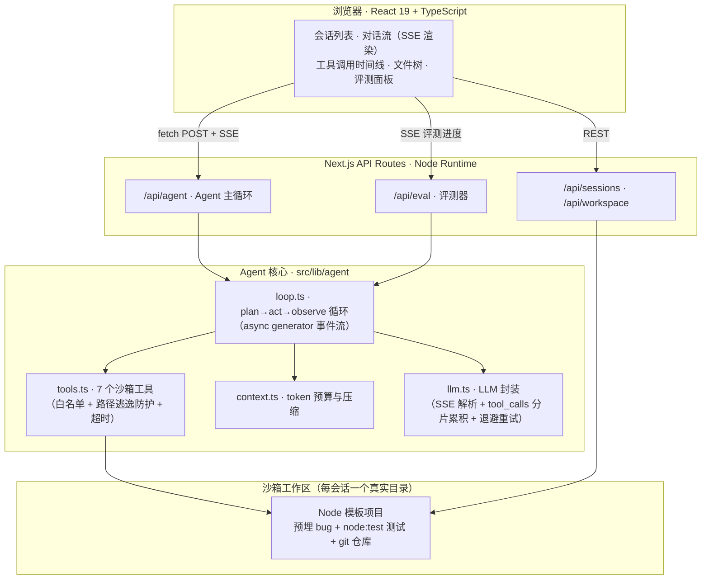

<div align="center">

# 🤖 DevMate — Browser-based Coding Agent

**在浏览器里给 Agent 一个编码任务，它自己读代码、改代码、跑测试、提交 Git —— 全程流式可视化。**

Next.js 16 · React 19 · TypeScript · LLM Tool Calling · SSE Streaming

</div>

---

## 这是什么？

DevMate 是一个从零实现的 **Coding Agent 全栈应用**，对标 Claude Code / Codex / CodeBuddy 的核心执行链路，做成「麻雀虽小、五脏俱全」的浏览器产品：

> 你输入「修复 mathutils.js 中的 bug，使全部测试通过并提交」，
> Agent 先**规划任务**，然后通过**工具调用**在沙箱里读文件、检索代码、写代码、运行测试、提交 Git，
> 每一步都以**流式**呈现在界面上 —— 你能看到它在想什么、调了什么工具、改了哪行代码。

它不是 LangChain Demo，也不是 API 套壳：Agent 循环、工具沙箱、上下文压缩、评测体系全部手写，约 **2000 行核心代码**。

## 核心特性

| 能力 | 实现 |
|---|---|
| 🧭 **任务规划** | 结构化输出（JSON steps）先生成 3-6 步计划，前端步骤清单可视化 |
| 🔧 **工具调用** | 7 个沙箱工具：`list_files` / `read_file` / `write_file` / `search_code` / `run_command` / `run_tests` / `git_operation` |
| 📡 **流式交互** | 服务端 SSE 事件流，token 级增量渲染 + 工具调用时间线交织输出 |
| 🗜️ **上下文管理** | token 预算控制，超限时自动压缩早期工具结果，压缩事件可观测 |
| 🛡️ **沙箱安全** | 每会话独立目录 + 独立 Git 仓库，路径规范化防 `..` 逃逸，命令白名单，子进程超时强杀 |
| ✅ **效果评估** | 四层评测：单元测试 + 4 常规任务 + **4 held-out 任务**（SWE-bench 式预置测试）+ **对照实验**，断言最终文件与测试退出码 |
| 🔬 **评测自检** | 变异测试攻击评测器本身：7 个变异体检出率 100%；发现并修复「删测试即可通过」的作弊盲区 |
| 🧪 **工程质量** | 34 个单元测试覆盖沙箱安全 / 工具执行 / 上下文压缩 / 防作弊 / 评测灵敏度 |
| 🔁 **限流韧性** | LLM 层指数退避重试（429/5xx），长评测链路不中断 |

## 实测结果

> 2026-09-26 在 Windows 11 / Node 22 / bun 1.4.2 上实际运行（非编造），
> 模型 `qwen3.8-max`（OpenAI 兼容接口）。

```
L1 单元测试：34/34 通过（bun test tests/agent.test.ts）

L2 常规评测集：4/4 通过，100%（bun scripts/run-eval.ts --only default）
  ✓ 修复 mathutils 使全部测试通过
  ✓ 新增 clamp 函数并补测试
  ✓ fibonacci 重构为迭代实现
  ✓ 为 README 补充使用说明

L2 held-out 评测集：4/4 通过，100%（另一个项目 stringutils，断言全部来自预置测试）
  ✓ 修复 slugify    ✓ 修复 camelCase    ✓ 实现 truncate    ✓ 实现 initials

L4 评测灵敏度：基线全通过 + 变异体检出率 100%（7/7，bun scripts/check-sensitivity.ts）
  作弊类 2/2（删空测试、清空 assert）｜逻辑退化类 5/5（off-by-one、漏导出、性能退化、边界遗漏、上下界写反）

端到端：规划 → 流式输出 → 工具调用 → 测试验证 → Git 提交，全链路验证通过
```

评测过程中的真实产物示例（Agent 自主完成，非人工修改）：

```
[工具] read_file {"path":"mathutils.js"}      → 发现 average 分母 off-by-one
[工具] write_file {"path":"mathutils.js",...} → 改 average / fibonacci / maxOf
[工具] run_tests {}                           → exit 0：通过 4 项，失败 0 项
[工具] git_operation {"action":"commit",...}  → [main 880d3c8] fix(mathutils): ...
```

## 对照实验：这些数字说明了什么，以及没说明什么

「通过率 100%」本身没有说服力 —— 它可能是系统强，也可能是题目太简单。
为此做了一组**对照实验（ablation）**：固定任务集，只改变 Agent 的一个能力维度。

### 强模型（qwen3.8-max）× 4 个常规任务

| 实验组 | 通过率 | 平均步数 | 平均工具调用 | 平均耗时 | 平均 token |
|---|---|---|---|---|---|
| A · 完整配置 | 100% (4/4) | 7.8 | 8.5 | 50.4s | **11322** |
| B · 无任务规划 | 100% (4/4) | 6.0 | 6.8 | 32.4s | 6545 |
| C · 无自我验证（去掉 run_tests） | 100% (4/4) | 6.0 | 6.5 | 38.4s | 6831 |
| D · 无代码检索（去掉 search_code） | 100% (4/4) | 7.0 | 7.5 | 46.6s | 8837 |
| E · 无上下文压缩 | 100% (4/4) | 7.0 | 7.8 | 43.7s | 8570 |
| F · 裸模型（无工具·单次输出） | 100% (4/4) | 1.0 | 0.0 | 32.0s | **2086** |

**结论（诚实版）**：在这批任务上，**六个组全部 100% 通过** —— 规划、代码检索、上下文压缩
甚至「完全不使用工具」都没有让通过率产生差异。唯一显著差异是**成本**：
完整配置消耗的 token 是裸模型的 **5.4 倍**。

也就是说：**当前任务集太简单，测不出 Agent 范式的价值**。
单文件、单 bug、`node --test` 秒级完成的任务，强模型一次性输出就能做对。
这不是评测的胜利，而是评测**区分度不足**的证据。

### 弱模型（qwen3.5-flash）× 同一批任务 —— 差异出现了

| 实验组 | 通过率 | 平均步数 | 平均工具调用 | 平均 token |
|---|---|---|---|---|
| A · 完整配置 | **75% (3/4)** | 6.5 | 5.8 | 6156 |
| C · 无自我验证（去掉 run_tests） | **50% (2/4)** | 7.8 | 7.0 | **11698** |
| F · 裸模型（无工具·单次输出） | **50% (2/4)** | 1.0 | 0.0 | 3771 |

**结论**：模型能力不足时，「改完自己跑测试确认」这一步带来 **+25pp 通过率**（50% → 75%）。
有意思的是 C 组反而更贵（11698 vs 6156 token）—— 因为不跑测试，Agent 只能反复试错。

**这才是 Agent 范式价值的证据**：它不是在模型已经能做对时更省，而是在模型**不确定**时，
通过环境反馈把错误纠回来。

### held-out 泛化

| 实验组 | 通过率（held-out 4 任务） |
|---|---|
| A · 完整配置 | 100% (4/4) |
| F · 裸模型 | 100% (4/4) |

换到另一个项目（stringutils）、断言全部来自预置测试，结论与常规集一致 ——
**说明结论可迁移，不是特定任务集的偶然结果**。

### 重复运行方差（稳定性）

强模型 × 完整配置 × 4 任务 × **3 轮** = 12 次运行：

```
通过率：100%（12/12）｜平均步数 6.6｜平均工具调用 7.3｜平均耗时 44.6s｜平均 token 8943
```

三轮全部通过，**未观察到方差** —— 说明强模型在这批任务上表现稳定，
单次通过率不是运气。但这也从另一面印证了「任务太简单」：稳定地简单。

### 已知局限

1. 任务规模小、单文件，区分度不足（上表已量化）；下一步需要**多文件、长链路、
   必须依赖环境反馈**的任务才能真正拉开差距。
2. 这不是 SWE-bench：真正的 SWE-bench 用真实 GitHub issue + 真实仓库 + Docker，
   本项目只是**方法论复刻**（预置失败测试 + held-out + 对照），不能与 SWE-bench 分数类比。
3. 样本量小（4 + 4 任务），单次通过率不代表稳定通过率，因此另做了重复运行观察方差。
4. 无多框架对照（未对照 LangChain 等）。

完整方法论见 **[docs/EVALUATION.md](docs/EVALUATION.md)**；原始报告见
`ablation-*.txt` 与 `sensitivity-report.txt`。

## 架构



### Agent 执行循环

```typescript
// src/lib/agent/loop.ts（简化示意）
for (step = 1; step <= maxSteps; step++) {
  compressContext(messages)                      // 1. 上下文预算控制
  const res = await chatStream(messages, TOOLS,  // 2. LLM + Tool Calling（流式）
    { onToken: t => queue.push({type:'token', text:t}) })
  if (!res.toolCalls.length)                     // 3. 无工具调用 → 输出最终总结
    return queue.push({ type:'final', summary: res.content })
  for (const tc of res.toolCalls) {
    queue.push({ type:'tool_call', ... })        // 4. 执行工具并回填结果
    const result = await executeTool(ctx, tc)
    messages.push({ role:'tool', content: result })
  }
}
```

**关键设计**：LLM 流式回调无法直接在 async generator 中 `yield`，因此采用「**事件队列 + 并发泵**」模式——回调实时 push 事件、外层 generator 实时消费，保证 token 流与工具事件在同一事件流中交织输出。

## 快速开始

```bash
git clone https://github.com/SeupLio/devmate-coding-agent.git
cd devmate-coding-agent
bun install
bun run db:push     # 初始化 SQLite（Prisma）
bun run dev         # http://localhost:3000
```

### 配置 LLM（首次运行必做）

项目支持两种 LLM 接入，通过环境变量 `LLM_PROVIDER` 切换（默认 `openai`）：

```bash
cp .env.example .env   # 然后填入你的密钥
```

```bash
# 方式一（推荐）：任意 OpenAI 兼容厂商 —— DeepSeek / 通义千问 / OpenAI 官方 / vLLM / Ollama
LLM_PROVIDER=openai
OPENAI_BASE_URL=https://api.deepseek.com      # 默认 https://api.openai.com/v1
OPENAI_API_KEY=sk-xxxxxx
OPENAI_MODEL=deepseek-chat                    # 默认 gpt-4o-mini

# 智谱开放平台（GLM-4-Flash 有免费额度）
LLM_PROVIDER=openai
OPENAI_BASE_URL=https://open.bigmodel.cn/api/paas/v4
OPENAI_API_KEY=你的Key
OPENAI_MODEL=glm-4-flash

# 方式二：智谱清言内部 SDK（仅在智谱沙箱内有凭证时可用）
LLM_PROVIDER=zai
```

> Windows 用户请先安装 [Bun](https://bun.sh)（或 `npm i -g bun`）与 Git，
> 并把 `C:\Program Files\Git\usr\bin` 加入 PATH，否则 Agent 的 `ls / cat / grep` 会报"找不到命令"。

在页面输入任务（或点击快捷任务），观察 Agent 全过程：

- **中间对话区**：任务规划清单 → 流式思考文本 → 可展开的工具调用卡片（参数/结果）
- **右侧工作区**：实时文件树 + 代码查看
- **右侧评测页签**：运行 4 任务评测集，查看通过率报告

命令行（不依赖界面）：

```bash
bun test tests/agent.test.ts                 # L1 单元测试（34 条）
bun scripts/run-agent.ts "修复 mathutils.js 的 bug 并提交"   # 单任务
bun scripts/run-eval.ts --only default       # L2 常规评测集
bun scripts/run-eval.ts --only holdout       # L2 held-out 评测集
bun scripts/run-ablation.ts                  # L3 对照实验
bun scripts/check-sensitivity.ts             # L4 评测灵敏度（不需要 LLM）
```

## 评测怎么做的？

「Agent 说它做完了」不算数 —— 评测器只看**最终事实**。整套评测分四层，
详细方法论见 **[docs/EVALUATION.md](docs/EVALUATION.md)**：

| 层 | 手段 | 回答什么问题 | 需要 LLM |
|---|---|---|---|
| L1 | **单元测试**（34 条） | 代码有没有坏？沙箱安全、工具、压缩逻辑对不对？ | 否 |
| L2 | **任务评测集**（4 常规 + 4 held-out） | 端到端链路能不能跑通？能否泛化到新项目？ | 是 |
| L3 | **对照实验**（5 组 + 裸模型） | 每个能力维度各自贡献多少？ | 是 |
| L4 | **评测灵敏度**（7 变异体） | 评测本身是不是太松？ | **否** |

几个关键设计：

1. **沙箱隔离**：每个任务在**全新沙箱副本**上运行（含独立 Git 仓库），杜绝状态泄漏；
2. **断言来源分层**：常规集用「测试退出码 + 文件内容」；**held-out 集 100% 用预置测试的退出码**
   （SWE-bench 式 FAIL_TO_PASS），不含任何按实现写的正则，因此无法靠迁就断言刷分；
3. **防作弊**：额外断言「原有测试用例未被删减」—— 否则 Agent 只要删测试就能让退出码变 0
   （这个盲区是 L4 发现的，不是想出来的）；
4. **灵敏度自检**：拿已知正确的参考解故意破坏成 7 个变异体，验证评测能否全部检出；
   等价变异体（语义不变）必须剔除，否则会误判评测有洞；
5. **容错**：若 Agent 在总结阶段被限流打断，但任务产物已通过全部断言，**不误判为失败**。

初始沙箱是一个故意埋了 3 类 bug 的数学工具库：`average` 分母 off-by-one、`fibonacci` 低效递归 + 边界错误（性能断言强制要求迭代实现）、`maxOf` 未导出。换掉 `assets/template-project/` 即可评测你自己的项目。

## 目录结构

```
src/
  app/
    page.tsx                  # 单页应用（会话 / 对话 / 工作区 / 评测）
    api/agent/route.ts        # Agent SSE 接口
    api/eval/route.ts         # 评测 SSE 接口
    api/sessions/...          # 会话 CRUD
    api/workspace/[id]/...    # 文件树 / 文件内容
  lib/agent/                   # Agent 核心
    loop.ts                   # 执行循环（事件队列 + 并发泵）
    tools.ts                  # 7 个沙箱工具 + filterTools（对照实验用）
    context.ts                # 上下文预算与压缩
    llm.ts                    # LLM provider 路由
    llm.openai.ts             # OpenAI 兼容实现（流式 + 重试）
    llm.zai.ts                # 智谱内部 SDK 实现
    prompts.ts                # 系统提示词
    workspace.ts              # 会话沙箱管理（独立 Git 仓库）
  lib/eval/                    # 评测体系
    tasks.ts                  # 常规 4 任务 + held-out 4 任务 + 防作弊断言
    runner.ts                 # 评测执行器（支持运行配置与重复轮次）
    ablation.ts               # 对照实验（5 组 + 裸模型执行器）
    sensitivity.ts            # 评测灵敏度检查（变异测试，不需要 LLM）
  components/agent/            # ToolCallCard / WorkspacePanel / EvalPanel
tests/agent.test.ts            # 34 个单元测试
scripts/run-agent.ts           # CLI 单任务入口
scripts/run-eval.ts            # CLI 评测入口（--only default|holdout, --repeat N）
scripts/run-ablation.ts        # CLI 对照实验入口
scripts/check-sensitivity.ts   # CLI 评测灵敏度入口
docs/EVALUATION.md             # 评测方法论（四层体系）
assets/template-project/       # 主沙箱模板（mathutils，预埋 bug）
assets/holdout-project/        # held-out 沙箱模板（stringutils，预置失败测试）
assets/reference-solution/     # 参考解（灵敏度实验基线）
```

## 技术选型说明

- **LLM 接入**：所有模型调用集中在 `src/lib/agent/` 下三个文件——`llm.ts`（provider 路由）、`llm.openai.ts`（OpenAI 兼容实现）、`llm.zai.ts`（智谱内部 SDK 实现）。**换 OpenAI / DeepSeek / Qwen 无需改代码，只改环境变量**；新增厂商也只需再加一个同签名模块。
- **为什么手写 Agent 循环而不用 LangChain**：Coding Agent 的核心难点在工具设计、上下文预算与评测，框架把这些藏起来了。手写一遍，才知道 Claude Code 们到底在做什么工程。
- **为什么用 node:test 而不是 jest**：沙箱项目要极简可运行，Node 22 内置测试器零依赖。

## Roadmap

- [ ] **更难的任务集**：多文件、长链路、必须依赖环境反馈才能完成 —— 当前任务集区分度不足（见上文对照实验）
- [ ] **多框架对照**：与 LangChain / 其他 Agent 实现跑同一批任务
- [ ] **重复运行方差**：每个任务跑 N 轮，报通过率均值 ± 方差（LLM 有随机性）
- [ ] **失败模式分类**：评测报告增加「失败原因归类」章节，而不只是通过率
- [ ] diff 视图（变更前后对比）
- [ ] 代码索引升级：AST / 向量检索替代 grep
- [ ] 跨端 WebView 适配（Electron / UE / Maya 内嵌面板）
- [ ] 多模型对比评测报告

## License

MIT
